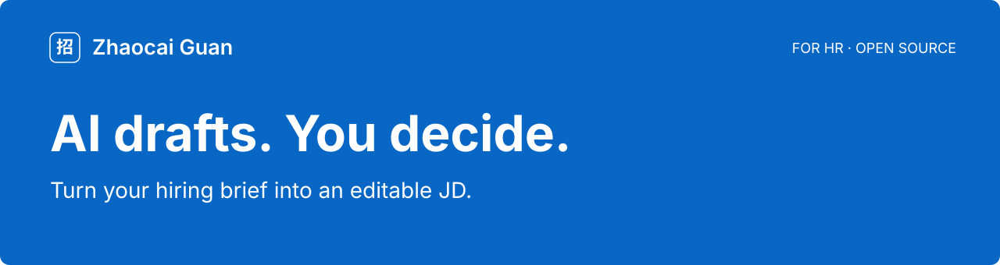

<picture>
  <source media="(max-width: 640px)" srcset="docs/brand/readme-hero-en-mobile.svg">
  
</picture>

<h1 align="center">Your local recruiting workspace, with AI</h1>
<p align="center">Clarify role requirements. Review résumé evidence. Cross-check interviews and assessments.<br>Manage materials on your Mac. Keep hiring decisions in your hands.</p>
<p align="center"><a href="https://github.com/denggui-ai/zhaocai-guan/releases/download/v1.0.1-rc.1/ZhaocaiGuan-macOS-arm64-1.0.1-20260930-r5-internal.dmg"></a></p>
<p align="center"><strong>Apple Silicon · 1.0.1 prerelease (rc.1) · Not Apple-notarized</strong><br>
<a href="docs/GETTING_STARTED.md#install">Installation help</a> · <a href="https://github.com/denggui-ai/zhaocai-guan/releases/tag/v1.0.1-rc.1">Release notes and other downloads</a> · <a href="README.md">中文</a></p>

## From role requirements to interview evidence

What does a hiring manager mean by “strong business understanding”? Which projects support a résumé's claims? What should HR ask when interviews and assessments disagree?

Use AI assistance at the stages where your materials are ready, with human review at each step.

| Recruiting question | AI assistance |
|---|---|
| **Who does this role need?** · Role profiling | Turn manager interviews into requirements and résumé evidence criteria; separate stated facts from inference, ask follow-up questions and revise after answers |
| **How do we describe the role?** · JD drafting | Organize responsibilities, required skills and preferences into an editable draft, with missing-information prompts |
| **What supports the résumé?** · Candidate review | Compare job requirements with résumé evidence; show matches, mismatches, unknowns, a dimension radar and interview questions |
| **What did the interview establish?** · Interview review | Organize transcripts and notes into facts, requirement checks, contradictions and unresolved items, with material references |
| **Do the materials agree?** · Assessment analysis | Cross-check the role, résumé, confirmed assessments and interviews for strengths, risks, contradictions and verification questions |

**AI organizes evidence and provides a second opinion. HR verifies facts and makes hiring decisions.** Candidate review includes dimension scores; assessment analysis includes a separate reference score and recommendation. Neither automatically changes S/A/B/C or the default ordering.

[**Capabilities, entry points and verification status →**](docs/AI-CAPABILITIES.md) *(Chinese)*

*All five have UI entry points and external-model call implementations. Real-provider testing currently covers one JD workflow; the other capabilities remain unvalidated. External AI is off by default, requires your own configuration, may incur charges and asks for confirmation before sending materials.*

## One real example: a hiring brief becomes a JD draft

A fictional brief was processed by DeepSeek `deepseek-flash` into **four responsibilities, two requirements and a separate nice-to-have**. Undecided pay, location, schedule and start date became questions for HR. A human added a delivery requirement and saved an inactive draft.

[See the input, original AI text, human edit and app screenshots](docs/AI-DEMO.md). The record also discloses two false warnings. This JD example does not validate the other AI workflows.

## See what needs your attention

Review candidate records, pending tasks and interview progress in the context of one job.

[](docs/showcase/workbench.png)

*The app, sample materials and full guide are in Chinese. All people and jobs shown are fictional. [Explore the candidate and interview views →](docs/DEMO.md)*

### From incoming résumés to interview follow-up

**Keep materials with the job.** Import authorized résumés, review them before confirming records, and retain the originals.

**Follow each candidate.** Review known facts, missing information and manual follow-up records. HR decides what happens next.

**Record interview arrangements.** Manually record times, interviewers and candidate responses, with a history for each round.

## Try two fictional résumés first

**No AI key or recruiting-platform account required.** Start with TXT materials and manual follow-up.

[**Download sample ZIP →**](https://github.com/denggui-ai/zhaocai-guan/releases/download/v1.0.1-rc.1/ZhaocaiGuan-demo-materials-1.0.1.zip) · [Step-by-step guide](docs/GETTING_STARTED.md#first-use)

1. Create a job, activate its JD, and confirm its hiring profile.
2. Import two TXT résumés, checking names, job and original text before confirming.
3. Open the candidates and their original materials; optionally record an interview manually.

The job should contain **two candidates**, with materials still accessible after restarting. [Sample contents and checksum](docs/examples/README.md)

## Before you start

<details>
<summary><strong>Platforms, installation and optional tools</strong></summary>

| Platform | Current scope |
|---|---|
| Mac Apple Silicon / arm64 | [DMG prerelease](https://github.com/denggui-ai/zhaocai-guan/releases/download/v1.0.1-rc.1/ZhaocaiGuan-macOS-arm64-1.0.1-20260930-r5-internal.dmg); not Apple-notarized |
| Mac Intel | Source only, not validated; no verified installer |
| Windows x64 | Experimental source, no installer; local recording and transcription disabled |
| Linux | Unsupported |

Verify the downloaded file's SHA-256, then move `招才官.app` into Applications. The app uses ad-hoc signing; follow the [documented macOS opening steps](docs/GETTING_STARTED.md#install) without disabling system-wide protection. Clean-Mac installation remains outstanding; AI verification is limited to the single JD workflow described above; see the [verified scope and limitations](https://github.com/denggui-ai/zhaocai-guan/releases/tag/v1.0.1-rc.1).

Mac screenshot OCR requires a working Xcode command-line toolchain or Xcode. PDF features use Poppler; local recording/transcription requires SoX, whisper-cli, and a model. These optional tools are not bundled. Start with TXT and add [tools as needed](docs/GETTING_STARTED.md#optional-tools).


</details>

<details>
<summary><strong>Optional AI, local data and backups</strong></summary>

AI is off by default. To enable it, configure your own HTTPS OpenAI-compatible Chat Completions service and verify a model. One JD workflow has been tested with DeepSeek `deepseek-flash`; see the [scope and known issues](docs/AI-DEMO.md). Other tasks and providers remain unverified. Material transmission requires separate confirmation; providers may charge and process materials under their terms. See [AI setup](docs/GETTING_STARTED.md#optional-ai).

Recruiting data is primarily local. Approved AI requests and optional authorized Feishu/Lark imports use external services. Before upgrading, quit the app and back up the complete data and any externally configured material directories. See [backup and recovery](docs/GETTING_STARTED.md#business-restore).


</details>

<details>
<summary><strong>Who is it for? Does it connect to recruiting platforms?</strong></summary>

For HR users managing recruiting on their own Mac. There is no shared recruiting backend. The app is independent of BOSS Zhipin and other recruiting platforms: it does not log in, synchronize, scrape, automatically contact candidates, or make hiring decisions. You handle communications and invitations yourself.

</details>

<details>
<summary><strong>Help and feedback</strong></summary>

[Installation and usage FAQ](docs/GETTING_STARTED.md#help) · [Report a problem](https://github.com/denggui-ai/zhaocai-guan/issues/new?template=bug_report.yml) · [Suggest an improvement](https://github.com/denggui-ai/zhaocai-guan/issues/new?template=feature_request.yml) · [Roadmap](ROADMAP.md)

Tell us the version, Mac chip, step reached, and expected versus actual result, including whether the sample records were created successfully. Use fictional materials only; do not upload candidate information or credentials. Report vulnerabilities through the [security policy](SECURITY.md). GitHub sign-in is needed to submit an issue, not to download the app.


</details>

<details>
<summary><strong>Development and source code</strong></summary>

Use Node.js 22 or later and npm; macOS also needs Xcode command-line tools:

```bash
npm ci
npx --no-install electron-rebuild -f -w better-sqlite3
npm run ui
```

See [development](DEVELOPMENT.md), [contributing](CONTRIBUTING.md), and [source guide](SOURCE-DEVELOPMENT-TUTORIAL.md). Licensed under [AGPL-3.0-only](LICENSE); dependencies retain their [respective licenses](THIRD_PARTY_NOTICES.md).

</details>

---

Licensed under [AGPL-3.0-only](LICENSE). [Third-party notices](THIRD_PARTY_NOTICES.md) · [Changelog](CHANGELOG.md)
