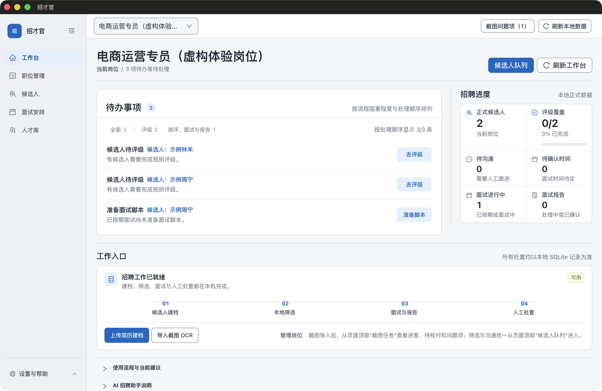
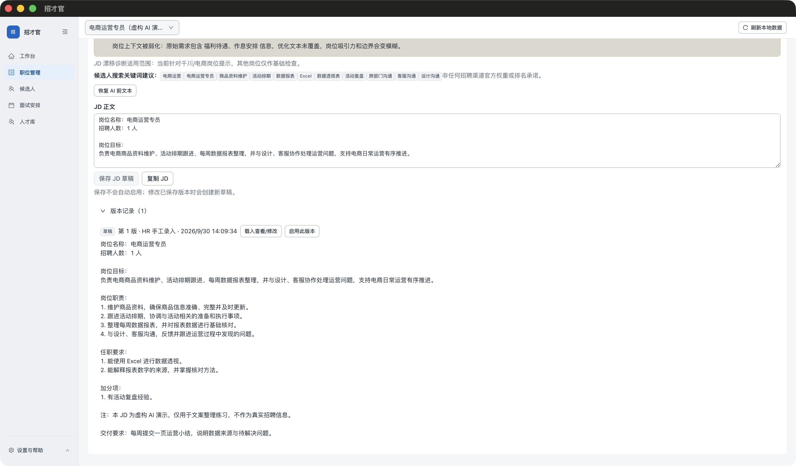

# Zhaocai Guan · 招才官

**From role requirements to interview review, give hiring decisions a traceable basis.**

A recruiting workspace for HR to organize roles, résumés, interviews and assessments. Materials are managed locally; optional AI connects to your configured external service.

[**Download for Mac**](https://github.com/denggui-ai/zhaocai-guan/releases/download/v1.0.1-rc.1/ZhaocaiGuan-macOS-arm64-1.0.1-20260930-r5-internal.dmg) · [Quick start](docs/GETTING_STARTED.md#first-use) · [Installation help](docs/GETTING_STARTED.md#install) · [中文](README.md)

Apple Silicon · **1.0.1-rc.1 prerelease** · Not Apple-notarized · **Chinese UI, samples and guide** · [Release notes and other downloads](https://github.com/denggui-ai/zhaocai-guan/releases/tag/v1.0.1-rc.1)

[](docs/DEMO.md)

*An unmodified application screenshot using fictional materials. [Explore candidate and interview views →](docs/DEMO.md)*

## From a hiring brief to a reviewable JD

This example comes from one real DeepSeek `deepseek-flash` call in the application, using a completely fictional role.

1. **Provide the brief.** An e-commerce operations specialist needs Excel pivot-table skills; campaign review experience is a preference. Pay and location are undecided.
2. **Review the AI draft.** Four responsibilities, two requirements, a separate preference and questions about missing information.
3. **Confirm the human edit.** Add a weekly one-page operations summary requirement and save version 1 as a draft, without activating it.

[](docs/AI-DEMO.md)

[Input](docs/ai-demo/input.txt) · [Original AI text](docs/ai-demo/ai-output.txt) · [Human edit](docs/ai-demo/manual-final.txt) · [Full record and two false warnings](docs/AI-DEMO.md)

**Only this JD scenario has real-provider workflow evidence. Other AI scenarios remain unvalidated.** External AI is off by default, requires your own configuration, may incur charges and asks for confirmation before sending materials.

## Find evidence throughout recruiting

| Your task | What the workspace can provide |
|---|---|
| **Clarify the role** | Turn manager interviews into a hiring profile, separate statements from inference, identify evidence criteria and follow-up questions |
| **Draft a job description** | Organize responsibilities, requirements and preferences into an editable JD |
| **Review résumé evidence** | Compare matches, mismatches and unknowns against the role, with source evidence, a dimension radar and interview questions |
| **Review an interview** | Organize transcripts and notes into facts, requirement checks, contradictions and unresolved items, with material references |
| **Cross-check assessments** | Combine the role, résumé, confirmed assessments and interviews to identify strengths, risks, contradictions and verification questions |

All five have UI entry points and external-model call implementations. Real-provider workflow testing covers only the JD example above. [Capabilities, entry points and verification status →](docs/AI-CAPABILITIES.md) *(Chinese)*

AI organizes materials and provides a second opinion; HR verifies facts and makes hiring decisions. Candidate dimension scores and separate assessment reference scores/recommendations do not automatically change S/A/B/C or the default ordering.

## Start with two fictional résumés

**No AI key or recruiting-platform account required.** Try local material management and manual follow-up first.

[Download sample ZIP](https://github.com/denggui-ai/zhaocai-guan/releases/download/v1.0.1-rc.1/ZhaocaiGuan-demo-materials-1.0.1.zip) · [Step-by-step guide](docs/GETTING_STARTED.md#first-use)

1. Create a job, activate its JD and confirm its hiring profile.
2. Import two TXT résumés, checking names, job and original text before confirming.
3. Open the candidates and original materials; optionally record an interview manually.

The correct job should contain **two candidates**, with original materials still accessible after restarting. [Sample contents and checksum](docs/examples/README.md)

## Before you start

<details>
<summary><strong>Platforms, installation and optional tools</strong></summary>

| Platform | Current scope |
|---|---|
| Mac Apple Silicon / arm64 | [DMG prerelease](https://github.com/denggui-ai/zhaocai-guan/releases/download/v1.0.1-rc.1/ZhaocaiGuan-macOS-arm64-1.0.1-20260930-r5-internal.dmg); not Apple-notarized |
| Mac Intel | Source only, not validated; no verified installer |
| Windows x64 | Experimental source, no installer; local recording and transcription disabled |
| Linux | Unsupported |

Verify the downloaded file's SHA-256, then move `招才官.app` into Applications. The app uses ad-hoc signing; follow the [documented macOS opening steps](docs/GETTING_STARTED.md#install) without disabling system-wide protection. Clean-Mac installation remains outstanding; AI verification is limited to the single JD workflow described above; see the [verified scope and limitations](https://github.com/denggui-ai/zhaocai-guan/releases/tag/v1.0.1-rc.1).

Mac screenshot OCR requires a working Xcode command-line toolchain or Xcode. PDF features use Poppler; local recording/transcription requires SoX, whisper-cli, and a model. These optional tools are not bundled. Start with TXT and add [tools as needed](docs/GETTING_STARTED.md#optional-tools).


</details>

<details>
<summary><strong>Optional AI, local data and backups</strong></summary>

AI is off by default. To enable it, configure your own HTTPS OpenAI-compatible Chat Completions service and verify a model. One JD workflow has been tested with DeepSeek `deepseek-flash`; see the [scope and known issues](docs/AI-DEMO.md). Other tasks and providers remain unverified. Material transmission requires separate confirmation; providers may charge and process materials under their terms. See [AI setup](docs/GETTING_STARTED.md#optional-ai).

Recruiting data is primarily local. Approved AI requests and optional authorized Feishu/Lark imports use external services. Before upgrading, quit the app and back up the complete data and any externally configured material directories. See [backup and recovery](docs/GETTING_STARTED.md#business-restore).


</details>

<details>
<summary><strong>Who is it for? Does it connect to recruiting platforms?</strong></summary>

For HR users managing recruiting on their own Mac. There is no shared recruiting backend. The app is independent of BOSS Zhipin and other recruiting platforms: it does not log in, synchronize, scrape, automatically contact candidates, or make hiring decisions. You handle communications and invitations yourself.

</details>

<details>
<summary><strong>Help and feedback</strong></summary>

[Installation and usage FAQ](docs/GETTING_STARTED.md#help) · [Report a problem](https://github.com/denggui-ai/zhaocai-guan/issues/new?template=bug_report.yml) · [Suggest an improvement](https://github.com/denggui-ai/zhaocai-guan/issues/new?template=feature_request.yml) · [Roadmap](ROADMAP.md)

Tell us the version, Mac chip, step reached, and expected versus actual result, including whether the sample records were created successfully. Use fictional materials only; do not upload candidate information or credentials. Report vulnerabilities through the [security policy](SECURITY.md). GitHub sign-in is needed to submit an issue, not to download the app.


</details>

<details>
<summary><strong>Development and source code</strong></summary>

Use Node.js 22 or later and npm; macOS also needs Xcode command-line tools:

```bash
npm ci
npx --no-install electron-rebuild -f -w better-sqlite3
npm run ui
```

See [development](DEVELOPMENT.md), [contributing](CONTRIBUTING.md), and [source guide](SOURCE-DEVELOPMENT-TUTORIAL.md). Licensed under [AGPL-3.0-only](LICENSE); dependencies retain their [respective licenses](THIRD_PARTY_NOTICES.md).

</details>

---

Licensed under [AGPL-3.0-only](LICENSE). [Third-party notices](THIRD_PARTY_NOTICES.md) · [Changelog](CHANGELOG.md)
