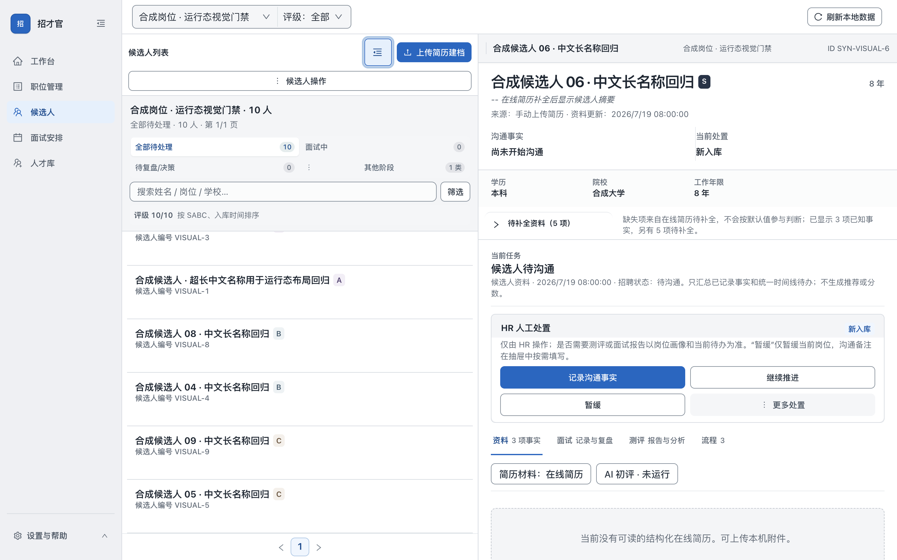

# 招才官 · Zhaocai Guan

**HR 的招聘桌面助手**

把岗位要求、简历、候选人和面试进度整理在自己的电脑上。你可以在 BOSS 直聘等渠道完成招聘沟通，再把有权使用的简历文件或截图导入招才官，核对材料、记录下一步，积累自己的招聘工作台。

[安装与第一次使用](docs/GETTING_STARTED.md) · [四步图解演示](docs/DEMO.md) · [虚构样例材料](docs/examples/README.md) · [路线图](ROADMAP.md) · [English](README.en.md)

**1.0.1 候选版（预发布）面向 Mac Apple 芯片。** [下载安装包与校验文件](https://github.com/denggui-ai/zhaocai-guan/releases/tag/v1.0.1-rc.1)。本轮已用虚构资料验证本地核心流程和同机原路径恢复；各修订版的实际验收范围见发行说明。干净 Mac 安装、真实 AI 服务等仍未验收，不宣称全功能生产就绪。

## 先看看能帮你做什么

- **统一岗位要求**：维护岗位、JD 和画像，保存版本，由 HR 启用和确认。
- **把简历整理到一起**：导入本地 TXT、PDF、Word 等文件；截图识别后先校对，再确认建档。
- **跟进每位候选人**：查看原始材料与评级依据，手工记录沟通、面试和后续决定。
- **保留招聘记录**：整理测评、面试材料和人才库，在本机保存工作进度。
- **按需使用 AI**：辅助起草和分析；不用 AI 也能进行本地材料管理和手工跟进。

招才官与 BOSS 直聘及其他招聘平台无隶属或官方合作关系。它不连接招聘平台账号，也不提供登录、自动同步、抓取、自动联系或自动录用功能；平台沟通仍由 HR 自己完成。

## 界面预览

以下为真实 Electron 窗口中的虚构岗位与候选人，不含真实招聘资料。




## 你的电脑能用吗

| 电脑 | 当前状态 |
|---|---|
| Mac Apple 芯片（Apple Silicon / arm64） | [预发布安装包](https://github.com/denggui-ai/zhaocai-guan/releases/tag/v1.0.1-rc.1)；未获 Apple 公证 |
| Mac Intel 芯片 | 仅源码，未验收，不提供已验证安装包 |
| Windows x64 | 实验性源码；首发无安装包，本机录音与转写禁用 |
| Linux | 未支持 |

在 Mac 的“关于本机”中查看芯片。取得对应版本的候选包后，按[安装指南](docs/GETTING_STARTED.md#install)核对来源和文件，再将 `招才官.app` 移到“应用程序”。未公证应用的打开步骤也在指南中；不要关闭全局系统安全保护。

## 用虚构简历开始

[样例材料](docs/examples/README.md)包含一个虚构岗位、画像参考和两份 TXT 简历。这个起点不需要招聘平台账号、AI 密钥、录音、PDF 或 OCR 工具。

1. **建岗位**：保存 JD 草稿，在版本记录中启用；填写画像草稿，再确认对应版本。
2. **导入简历**：进入“候选人 → 上传简历建档”，选一份样例，核对姓名、岗位和原文后确认。
3. **开始跟进**：在当前岗位查看候选人和材料，由 HR 决定后续安排。

具体按钮与核对方法见[第一次使用](docs/GETTING_STARTED.md#first-use)。样例不是预置数据库，不会自动载入现有业务数据。OCR、转写和 AI 草稿都可能出错，请保留原始材料并人工核对。

<a id="requirements"></a>
## 用到时再准备依赖

| 想使用的能力 | 需要准备什么 |
|---|---|
| 岗位管理、TXT 简历与手工跟进 | 正常安装应用即可开始，不需要外部 AI |
| Mac 截图识别 | 系统 Vision，以及可用的 Xcode 命令行工具或完整 Xcode |
| PDF 提取、预览 | Poppler；扫描 PDF 还需要适用的 OCR 工具 |
| Mac 本地录音与转写 | SoX、whisper-cli 和本地模型，另需主动授予麦克风权限 |

这些工具不随当前候选应用打包。按[依赖说明](docs/GETTING_STARTED.md#optional-tools)准备需要的那一项即可。非 macOS 截图使用逐图批准的外部多模态 AI；安装 Tesseract 不能替代这条路径。

<a id="external-ai"></a>
## AI 是可选项

外部 AI 默认关闭。需要时，使用自己的 HTTPS OpenAI-compatible 服务、访问密钥和支持 Chat Completions 的模型，在设置中保存、验证并启用。图像识别还需要支持图片输入的模型。当前未发布真实供应商兼容性名单，不承诺任意模型都能使用。

每次发送材料前都需确认拟发送内容；保存密钥或通过模型验证不等于批准外发。服务方可能收费并按其规则处理材料。密钥由系统安全存储加密；若只能在本次会话生效，应用会明确提示。详见[AI 配置步骤](docs/GETTING_STARTED.md#optional-ai)。

## 数据由你保管

候选人资料和工作进度以本机存储为主，项目不提供共享招聘后端。实际运行目录可在设置页查看；备份时完全退出应用，保存整个数据目录及位于其他位置的数据库、面试材料，避免只拷贝 SQLite 主文件。

启用并批准外部 AI 后，选定材料会发送给你配置的服务；可选飞书/Lark 妙记导入也会使用本机已有授权联网。也可以直接粘贴有权使用的转写文本。“本机保存”并不表示所有可选功能都离线。

从旧版本升级时先备份。旧 v1 AI 凭据需重新输入和验证；更名或设备变化也可能影响系统密钥读取。遇到问题按[凭据恢复步骤](DEVELOPMENT.md#ai-credential-recovery)处理，保留业务数据。

## 求助与参与

安装问题先看[常见问题](docs/GETTING_STARTED.md#help)。可通过[中文缺陷或功能建议表单](https://github.com/denggui-ai/zhaocai-guan/issues/new/choose)反馈；仅附虚构材料或脱敏日志。安全漏洞按[安全策略](SECURITY.md)私下报告。

欢迎改进安装说明、提供合成复现和参与 Windows 真机验证。计划见[路线图](ROADMAP.md)，贡献前阅读[参与指南](CONTRIBUTING.md)和[行为准则](CODE_OF_CONDUCT.md)。

## 开发者从这里开始

准备 Node.js 22 或更高版本、npm；Mac 还需 Xcode 命令行工具。在源码根目录执行：

```bash
npm ci
npx --no-install electron-rebuild -f -w better-sqlite3
npm run ui
```

Electron 固定为 42.5.1；SQLite 模块须匹配 Electron ABI。完整环境、检查与构建见[开发指南](DEVELOPMENT.md)，结构说明见[源码导览](SOURCE-DEVELOPMENT-TUTORIAL.md)。

## 开源许可

采用 [GNU AGPL-3.0](LICENSE)（`AGPL-3.0-only`）。第三方组件保留各自许可证，见[第三方声明](THIRD_PARTY_NOTICES.md)和[许可证文本](THIRD_PARTY_LICENSES.txt)。版本变化见[CHANGELOG](CHANGELOG.md)，产品边界见[开源决策](docs/decisions/2026-09-28-open-source.md)，新名称见[品牌决定](docs/decisions/2026-09-30-zhaocai-guan.md)。
