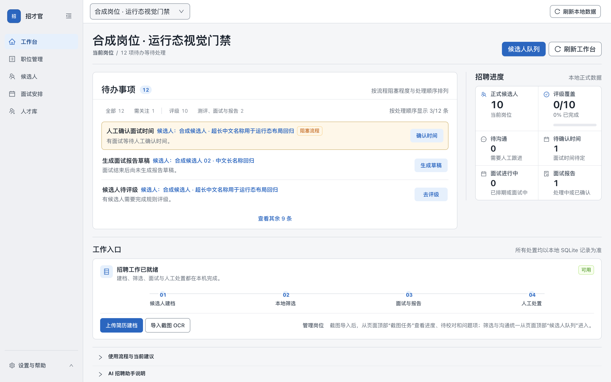

# 招才官——HR 的本地招聘工作台

**把简历、候选人和面试进度，整理到一个工作台。**

### [下载 Mac Apple 芯片版（DMG）](https://github.com/denggui-ai/zhaocai-guan/releases/download/v1.0.1-rc.1/ZhaocaiGuan-macOS-arm64-1.0.1-20260930-r5-internal.dmg)

**1.0.1 候选版（rc.1）· 仅 Mac Apple 芯片（M 系列）· 未获 Apple 公证**

[安装包校验文件](https://github.com/denggui-ai/zhaocai-guan/releases/download/v1.0.1-rc.1/ZhaocaiGuan-macOS-arm64-1.0.1-20260930-r5-internal-SHA256SUMS.txt) · [ZIP 备选](https://github.com/denggui-ai/zhaocai-guan/releases/download/v1.0.1-rc.1/ZhaocaiGuan-macOS-arm64-1.0.1-20260930-r5-internal.zip) · [发行说明与已知限制](https://github.com/denggui-ai/zhaocai-guan/releases/tag/v1.0.1-rc.1)

[看实际界面](docs/DEMO.md) · [下载体验材料](https://github.com/denggui-ai/zhaocai-guan/releases/download/v1.0.1-rc.1/ZhaocaiGuan-demo-materials-1.0.1.zip) · [安装帮助](docs/GETTING_STARTED.md#install) · [English](README.en.md)



*真实应用界面，使用虚构岗位与候选人。第一次体验可从 TXT 简历开始，不需要 AI Key、招聘平台账号或额外 OCR/PDF 工具。*

## 让三个招聘环节更好整理

| 你的工作 | 招才官怎样帮你 |
|---|---|
| 简历散在不同文件里 | 按岗位导入有权使用的简历，核对原文后确认建档；保留原始材料，方便回看 |
| 候选人到了哪一步不好查 | 在岗位下查看候选人、材料和人工跟进记录；下一步由 HR 决定 |
| 面试安排与资料分开保存 | 手工记录面试时间，整理面试与测评材料，将合适的人选保留到人才库 |

适合希望在自己的 Mac 上整理招聘工作的 HR 和招聘负责人。当前以单机使用为主，不提供团队共享招聘后端。招才官与 BOSS 直聘等平台无官方关联，不连接平台账号、自动同步、抓取或自动联系候选人；招聘沟通和邀约由你完成。

## 先用两份虚构简历试一次

[下载体验材料 ZIP](https://github.com/denggui-ai/zhaocai-guan/releases/download/v1.0.1-rc.1/ZhaocaiGuan-demo-materials-1.0.1.zip) · [样例校验文件](https://github.com/denggui-ai/zhaocai-guan/releases/download/v1.0.1-rc.1/ZhaocaiGuan-demo-materials-1.0.1-SHA256SUMS.txt) · [查看材料清单](docs/examples/README.md)

1. **建岗位**：复制样例 JD，保存并启用；按参考填写画像，保存并确认。
2. **导入简历**：选择两份 TXT，分别核对姓名、岗位和原文，再确认建档。
3. **查看并跟进**：在正确岗位下打开两位候选人及原始材料；需要时手工记录面试安排。

**体验完成的标志：**这个岗位有 2 位候选人，能打开原始材料，正常退出重开后仍保留。按[带按钮说明的首次使用指南](docs/GETTING_STARTED.md#first-use)操作；样例全为虚构，不预设评级或录用结论。

## 你的电脑能用吗

| 电脑 | 当前状态 |
|---|---|
| Mac Apple 芯片（M 系列 / arm64） | [下载 DMG](https://github.com/denggui-ai/zhaocai-guan/releases/download/v1.0.1-rc.1/ZhaocaiGuan-macOS-arm64-1.0.1-20260930-r5-internal.dmg)；1.0.1 候选版，未获 Apple 公证 |
| Mac Intel 芯片 | 仅源码，未验收，无已验证安装包 |
| Windows x64 | 实验性源码，暂无安装包；本地录音与转写禁用 |
| Linux | 未支持 |

在苹果菜单“关于本机”查看芯片。下载后核对 SHA-256，把 `招才官.app` 放入“应用程序”，按[安装与首次打开指引](docs/GETTING_STARTED.md#install)操作。当前包采用 ad-hoc 本地签名；不要关闭全局系统安全保护。干净 Mac 安装、真实 AI 服务等未完成验收，完整范围见[发行说明](https://github.com/denggui-ai/zhaocai-guan/releases/tag/v1.0.1-rc.1)。

<a id="requirements"></a>
**需要时再开启进阶能力。** Mac 截图识别需 Xcode 命令行工具或完整 Xcode；PDF 需 Poppler；录音/本地转写需 SoX、whisper-cli 和模型。这些依赖不随应用打包，详见[按需准备工具](docs/GETTING_STARTED.md#optional-tools)。截图识别后先校对再建档，转写和 AI 草稿也需人工核对。

<a id="external-ai"></a>
## AI 可选，资料由你管理

- **不用 AI 也能开始。** 外部 AI 默认关闭，TXT 简历整理和手工跟进无需 AI Key。需要辅助起草或分析时，再配置自己的 HTTPS OpenAI-compatible 服务并验证模型；目前没有已完成真实服务验收的兼容名单。
- **发送材料前逐次确认。** 核对用途、拟发送材料和服务后再批准；保存密钥不等于批准外发。服务方可能收费并按其规则处理材料。[AI 配置步骤](docs/GETTING_STARTED.md#optional-ai)
- **招聘资料主要存于本机。** 批准外部 AI、授权飞书/Lark 导入时会联网。升级前退出应用并备份整套资料，而非只复制数据库主文件。[备份与恢复](docs/GETTING_STARTED.md#business-restore)

## 遇到问题，从这里开始

安装被拦截、Windows 支持、是否需要 AI Key、截图/PDF 缺工具等问题，集中见[安装与使用 FAQ](docs/GETTING_STARTED.md#help)。

[报告使用问题](https://github.com/denggui-ai/zhaocai-guan/issues/new?template=bug_report.yml) · [提出使用建议](https://github.com/denggui-ai/zhaocai-guan/issues/new?template=feature_request.yml) · [后续计划](ROADMAP.md)

反馈时说明应用版本、Mac 芯片、完成到了哪一步、预期与实际结果；可以告诉我们是否已用样例完成首次建档。只附虚构材料或脱敏信息，勿上传真实简历、电话或密钥；安全漏洞按[安全策略](SECURITY.md)私下报告。提交 GitHub Issue 需要登录 GitHub，下载安装包不需要。

## 开发者从这里开始

准备 Node.js 22 或更高版本、npm；Mac 还需 Xcode 命令行工具。在源码根目录执行：

```bash
npm ci
npx --no-install electron-rebuild -f -w better-sqlite3
npm run ui
```

Electron 固定为 42.5.1；SQLite 模块须匹配 Electron ABI。完整环境、检查与构建见[开发指南](DEVELOPMENT.md)，结构说明见[源码导览](SOURCE-DEVELOPMENT-TUTORIAL.md)。

## 开源许可

采用 [GNU AGPL-3.0](LICENSE)（`AGPL-3.0-only`）。第三方组件保留各自许可证，见[第三方声明](THIRD_PARTY_NOTICES.md)和[许可证文本](THIRD_PARTY_LICENSES.txt)。版本变化见[CHANGELOG](CHANGELOG.md)，产品边界见[开源决策](docs/decisions/2026-09-28-open-source.md)，新名称见[品牌决定](docs/decisions/2026-09-30-zhaocai-guan.md)。
