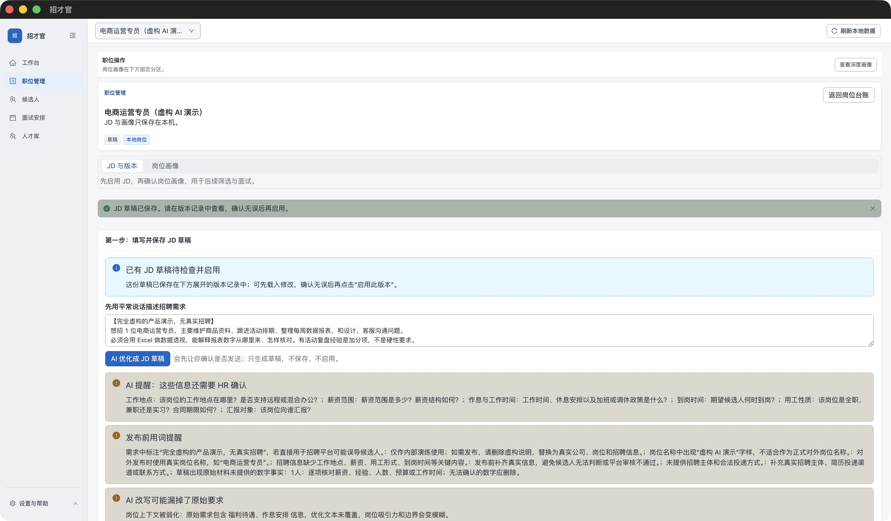

# 看一次真实 AI 起草：从招聘需求到 JD 草稿

**AI 先整理，你再核对和修改，最后决定是否保存、启用。** 本页记录 2026 年 9 月 30 日在实际 1.0.1 r5 Mac 应用中完成的一次操作，使用完全虚构岗位，没有候选人资料。

本案例只展示 JD 起草。完整产品还包括深度岗位画像、候选人初评、面试复盘和测评综合分析，见[全部 AI 能力与验证状态](AI-CAPABILITIES.md)。

## 01 · 用平常说话描述需求

这是实际输入的全文，可[打开 TXT 复制](ai-demo/input.txt)：

> 【完全虚构的产品演示，无真实招聘】
> 想招 1 位电商运营专员，主要维护商品资料、跟进活动排期、整理每周数据报表，和设计、客服沟通问题。
> 必须会用 Excel 做数据透视，能解释报表数字从哪里来、怎样核对。有活动复盘经验是加分项，不是硬性要求。
> 工作地点、薪资、作息和到岗时间还没确定，不要替我补。请整理成清楚的 JD 草稿，并列出需要我确认的信息。

点击“AI 优化成 JD 草稿”，实际确认框列出接收方 `api.deepseek.com`、模型 `deepseek-flash`、系统规则与本次发送材料。本次批准发送的只有虚构岗位名称和上述需求，以及应用的系统规则；不含候选人、简历或面试材料。

## 02 · 看 AI 整理了什么

| 输入里的要求 | 本次返回结果 |
|---|---|
| 商品资料、活动排期、周报、跨部门沟通 | 整理成 4 条岗位职责 |
| Excel 数据透视，解释来源和核对数字 | 保留为 2 条必须条件 |
| 活动复盘经验是加分项 | 单列“加分项”，没有提升为硬性条件 |
| 地点、薪资、作息、到岗时间未定 | 正文未编造这些信息；列出待 HR 确认的问题 |

还提出了用工性质、汇报对象的确认问题。[查看未经人工编辑的完整 AI 草稿](ai-demo/ai-output.txt)。这里保存的是应用实际显示的正文，不是重新撰写的示例，也不是服务端原始 JSON。

*两张图片均为实际应用原始截图，拍摄于人工保存后；仅调整窗口大小、显示缩放和滚动位置，没有改图或替换界面。点击查看大图。*

## 03 · 人工补一句，再保存

人工检查后，在正文末尾增加：

> 交付要求：每周提交一页运营小结，说明数据来源与待解决问题。

这句话是演示中的**人工补充**，不是模型自动生成。点击“保存 JD 草稿”后，出现第 1 版草稿；版本来源显示“HR 手工录入”，因为 AI 草稿又经过人工编辑。此标签本身不能记录完整 AI 来源，前后文本保留在本页供对照。

[查看最终保存文本](ai-demo/manual-final.txt)。生成结束、人工保存之前，JD 版本数为 **0**；人工保存后为 **1**，状态为 `draft`，启用时间为空。此次没有启用 JD，也没有向招聘平台发布。

## 这次实测的范围与不足

- **真实服务已跑通一个场景。** 服务根地址为 `https://api.deepseek.com/v1`，模型 ID 为 `deepseek-flash`；先通过应用内 Chat Completions、严格 JSON 与返回型号一致性测试，再完成 JD 生成、人工编辑和保存。
- **检查提示有误报。** 原文写“1 位”，结果写“1 人”，被提示为新增数字；原文说薪资与作息尚未确定，却出现“福利待遇、作息安排被漏掉”的诊断。人工对照后没有据此补造信息。这两处问题尚未修复，不能把提醒当成准确性保证。
- **只验证这一次 JD 流程。** 不代表其他模型、服务、候选人分析、岗位深度画像、面试辅助或真实招聘材料准确率已验收；也没有做稳定性或节省时间的统计。模型再次运行可能返回不同内容。
- **AI 是可选外部服务。** 默认关闭，需自己的服务配置，可能产生费用。每次发送前核对材料与接收方；生成、保存和启用是分开的动作。[配置步骤](GETTING_STARTED.md#optional-ai)

实测使用独立空数据目录，从 UI 新建虚构岗位，经应用原有审批和服务调用流程完成；未注入模型返回、伪造审批状态或修改应用代码。公开记录包括[结果摘要](ai-demo/result.json)、输入与两份正文、原始截图及 [SHA-256 清单](ai-demo/manifest.json)。密钥、私有日志和本机配置不在公开材料中。

[返回首页](../README.md) · [不配置 AI 的首次体验](GETTING_STARTED.md#first-use) · [查看工作台与候选人界面](DEMO.md)
