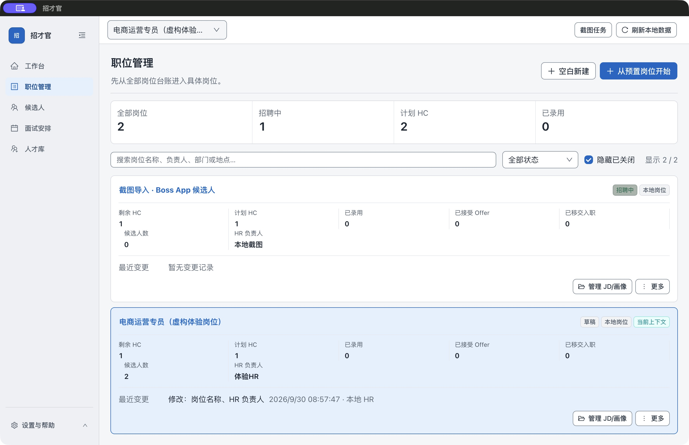
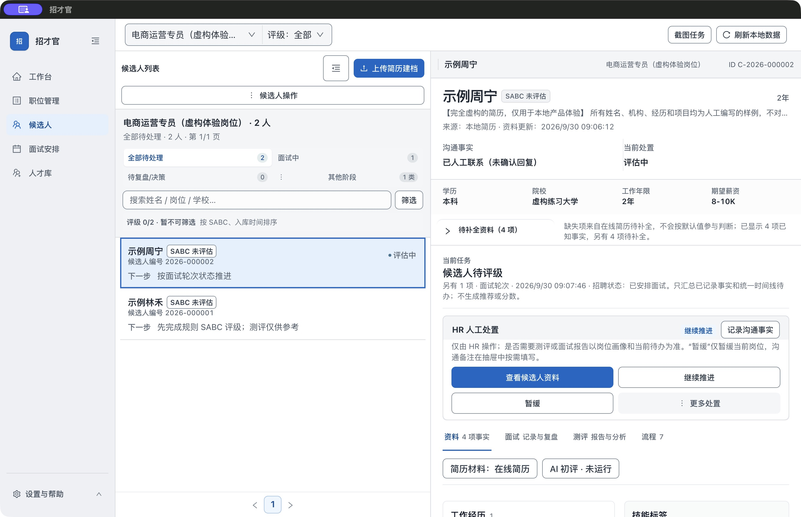
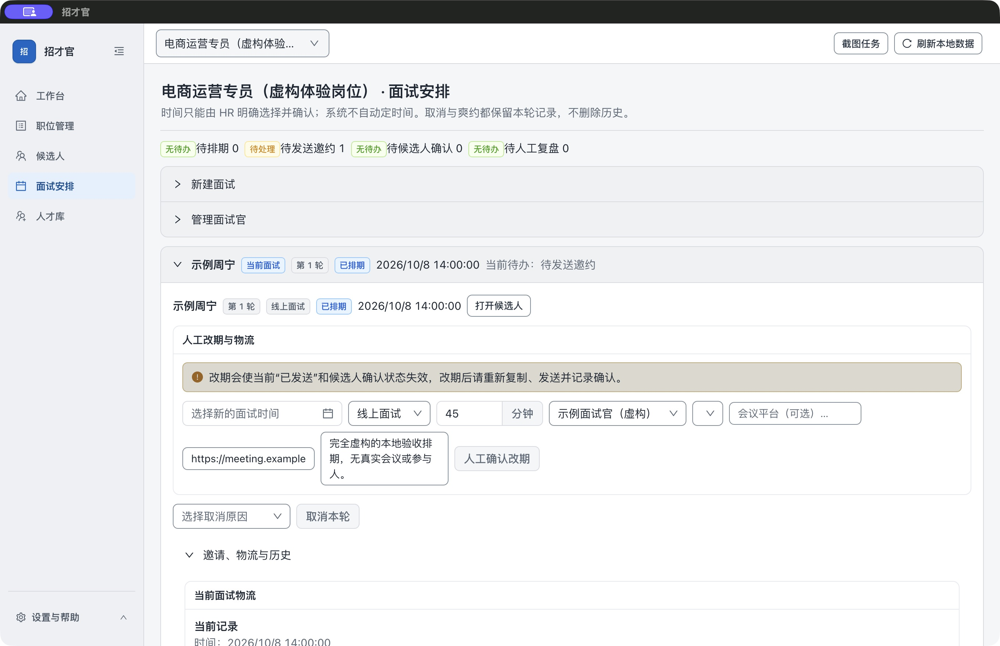
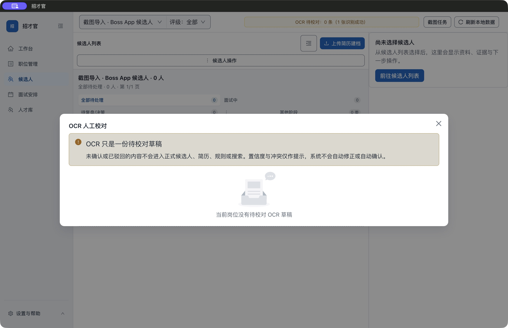

# 早期版本图解存档

**从一份岗位要求，到两位候选人和一次人工面试安排。** 下面的图解使用实际 Mac 应用窗口与完全虚构的招聘材料；基础流程不需要 AI Key、平台账号或 OCR/PDF 工具。

[下载 Mac 版](https://github.com/denggui-ai/zhaocai-guan/releases/download/v1.0.1-rc.1/ZhaocaiGuan-macOS-arm64-1.0.1-20260930-r5-internal.dmg) · [下载体验材料](https://github.com/denggui-ai/zhaocai-guan/releases/download/v1.0.1-rc.1/ZhaocaiGuan-demo-materials-1.0.1.zip) · [跟着步骤自己试](GETTING_STARTED.md#first-use)

当前提供 1.0.1 Mac Apple 芯片候选版，未获 Apple 公证；首次打开见[安装帮助](GETTING_STARTED.md#install)。截图来自早期 1.0.1 候选包，拍摄版本与验证范围见页尾。

## 1. 建立岗位，确认招聘要求

新建“电商运营专员（虚构体验岗位）”，复制样例 JD，保存后在版本记录中启用；按画像参考填写，再保存并确认画像。进入候选人页面前，确认顶部当前岗位正确。

*这张图拍摄于简历建档后，因此电商岗位显示 2 人；刚创建岗位时应为 0 人。截图工作区是另一独立岗位，不属于 TXT 基础体验。*

## 2. 导入简历，核对后再建档

进入“候选人 → 上传简历建档”，选中样例包第一份 TXT，在确认窗口核对岗位、姓名和原文，再点击“确认建档”。第二份重复同样操作。

**确认后的结果应是 2 位候选人。** 仅选择文件或取消预览不会新增记录；上传 JD 也不能代替上传简历。详细按钮和字段核对见[首次使用第 3 步](GETTING_STARTED.md#first-use)。

## 3. 打开候选人，回看原始材料

选择“示例林禾”或“示例周宁”，打开原始简历，核对已提取的信息和缺项。之后由 HR 手工记录跟进、决定下一步。

*图中的“已人工联系（未确认回复）”“评估中”来自后续人工记录；导入本身不会联系候选人。评级为“未评估”、AI 初评为“未运行”，没有自动录用结论。*

## 4. 手工安排面试，邀约由你发送

在“面试安排”中记录未来时间、时长和虚构面试官，注明“虚构演练，无需联系”，不要填写真实会议链接。

*图中是 2026 年 10 月 8 日 14:00、45 分钟的虚构安排，会议链接使用 `example.invalid`；演示没有发送消息或创建真实会议。自己试用时填写合适的未来时间。*

**完成检查：**选回虚构岗位，确认 2 位候选人及原始材料可打开；正常退出重开后，岗位、JD、画像和材料仍保留。遇到差异可用[中文缺陷表单](https://github.com/denggui-ai/zhaocai-guan/issues/new?template=bug_report.yml)反馈版本、步骤与实际结果。

## 进阶体验：截图先校对，再决定是否建档

截图 OCR 不属于上述 TXT 起步流程，也不包含在体验 ZIP 中。Mac 截图识别需[可用的本地 OCR 工具](GETTING_STARTED.md#optional-tools)。

导入有权使用的截图后，先对照原图校对草稿，确认岗位和内容后再建档。下面的实际演示选择了驳回：待校对变为 0，正式候选人仍为 0，说明识别完成并不等于已经入库。

*“Boss App”是截图来源工作区名称。图中使用人工合成图片，没有登录或连接 BOSS 直聘。*

[下载体验材料](https://github.com/denggui-ai/zhaocai-guan/releases/download/v1.0.1-rc.1/ZhaocaiGuan-demo-materials-1.0.1.zip) · [首次使用指南](GETTING_STARTED.md#first-use) · [发行说明](https://github.com/denggui-ai/zhaocai-guan/releases/tag/v1.0.1-rc.1)

截图版本与验证范围

截图拍摄于 2026 年 9 月 30 日，来自 1.0.1 Apple Silicon 实际应用包，源提交 `c7c91f5`。使用隔离空数据目录、真实窗口和文件选择器，没有 fixture 模式或替换 IPC/网络响应。四张原始图片未修改，来源与 SHA-256 见[截图清单](demo/manifest.json)。这是一份静态图解，不是操作录像。

这些图拍摄于经历解析修复前，不作为该修复或最终 r5 全流程验收的证据。各修订版实际验收范围以发行说明为准；干净系统安装、真实 AI、麦克风及系统钥匙串不在截图证明范围内。

[返回新版界面展示](DEMO.md)
