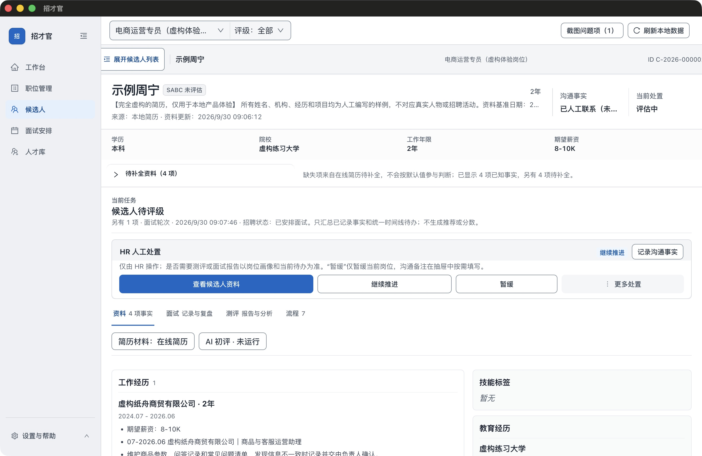
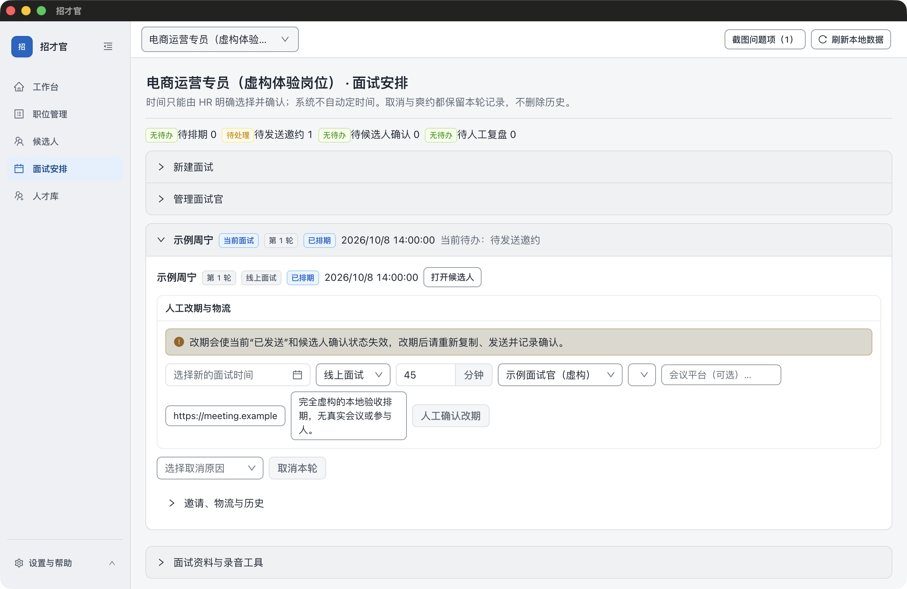

# 看看招才官怎样整理一天的招聘工作

从岗位待办，到候选人资料，再到面试安排。下面是 **r5 Mac 发布包的真实界面**，使用完全虚构的岗位与人物；点击图片可看原图。

[下载 Mac Apple 芯片版](https://github.com/denggui-ai/zhaocai-guan/releases/download/v1.0.1-rc.1/ZhaocaiGuan-macOS-arm64-1.0.1-20260930-r5-internal.dmg) · [用样例自己试一次](https://github.com/denggui-ai/zhaocai-guan/releases/download/v1.0.1-rc.1/ZhaocaiGuan-demo-materials-1.0.1.zip) · [返回首页](../README.md)

1.0.1 候选版（rc.1），未获 Apple 公证。[安装帮助](GETTING_STARTED.md#install)

## 岗位里的人与事，一起看清楚

打开电商运营岗位，看到两位候选人、尚待处理的评级和已经排期的面试。工作台汇总已记录的状态，方便你决定先跟进谁。

## 先看事实，再决定下一步

“示例周宁”的资料、已知事实、待补信息与人工跟进记录放在同一个视图。收起候选人列表，可以专注查看当前资料。截图中的评级为“未评估”，AI 初评未运行。

[查看候选人队列与详情并排的界面](showcase/candidate.png)

## 时间由你确认，安排留下记录

虚构面试安排在 2026 年 10 月 8 日 14:00，时长 45 分钟。当前状态为“已排期、待发送邀约”；登记面试不会自动联系候选人，演示中没有发送消息或创建真实会议。

## 自己试一次

[下载五份文本体验材料](https://github.com/denggui-ai/zhaocai-guan/releases/download/v1.0.1-rc.1/ZhaocaiGuan-demo-materials-1.0.1.zip)，按[首次使用指南](GETTING_STARTED.md#first-use)创建岗位、确认 JD 与画像，再逐份核对并导入两份 TXT 简历。无需 AI Key、招聘平台账号或 OCR/PDF 工具。

**完成标志：**正确岗位下有 2 位候选人；原始材料能打开；正常退出并重开后资料仍保留。

截图来源、版本与演示边界

2026 年 9 月 30 日从未修改的 1.0.1 r5 Apple Silicon 应用拍摄，源提交 `93526d8b7b46116671e18ba7750e085902a55462`。使用此前通过真实界面创建的虚构演示数据的隔离副本；本轮重拍验证的是显示状态，不是完整业务验收，也不证明历史导入数据已重新解析。

图片为未经修改的原始窗口截图，没有替换界面、伪造评级或 AI 输出。顶栏“截图问题项”属于另一独立工作区的历史截图任务，不属于本页 TXT 体验。会议地址为不可用的虚构示例地址。

[截图清单与 SHA-256](showcase/manifest.json) · [早期图解与 OCR 演示存档](DEMO-ARCHIVE.md) · [发行说明与验证范围](https://github.com/denggui-ai/zhaocai-guan/releases/tag/v1.0.1-rc.1)

